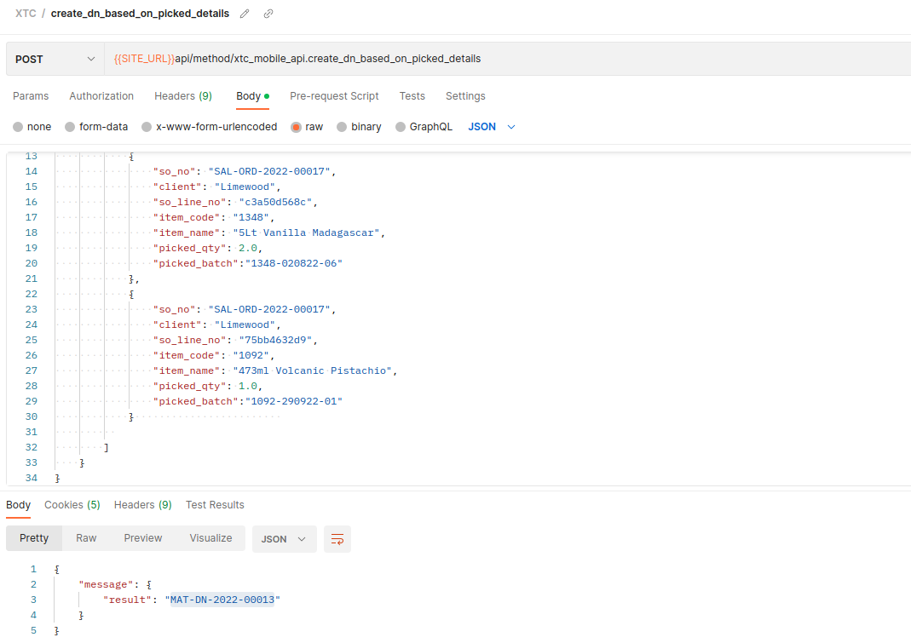

## XTC API

API to create picklist from mobile

**create_dn_based_on_picked_details**


```
{

    "message": {

        "result": [

            {

                "so_no": "SAL-ORD-2022-00017",

                "client": "Limewood",

                "so_line_no": "c3a50d568c",

                "item_code": "1348",

                "item_name": "5Lt Vanilla Madagascar",

                "picked_qty": 1.0,

                "picked_batch":"1348-020822-04"

            },

            {

                "so_no": "SAL-ORD-2022-00017",

                "client": "Limewood",

                "so_line_no": "c3a50d568c",

                "item_code": "1348",

                "item_name": "5Lt Vanilla Madagascar",

                "picked_qty": 2.0,

                "picked_batch":"1348-020822-06"

            },

            {

                "so_no": "SAL-ORD-2022-00017",

                "client": "Limewood",

                "so_line_no": "75bb4632d9",

                "item_code": "1092",

                "item_name": "473ml Volcanic Pistachio",

                "picked_qty": 1.0,

                "picked_batch":"1092-290922-01"

            }                        

          

        ]

    }

}
```


#### License

MIT

